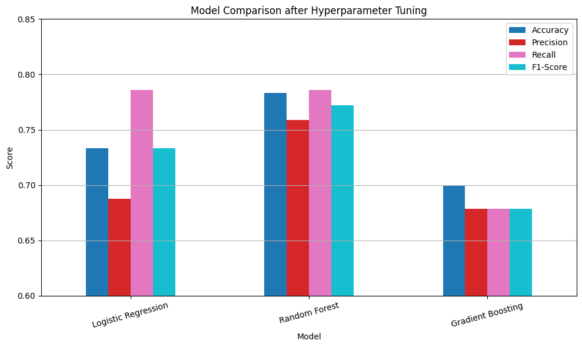

# Week 6 – Model Evaluation and Hyperparameter Tuning

## Objective
The goal of this week's assignment was to train multiple machine learning classification models and evaluate their performance using metrics such as:
- Accuracy
- Precision
- Recall
- F1-Score

Additionally, we implemented hyperparameter tuning using `GridSearchCV` and `RandomizedSearchCV` to improve model performance and select the best-fit model.

## Dataset
We used the **Heart Disease UCI Dataset** which contains 297 rows and 14 columns. The target variable `condition` indicates the presence or absence of heart disease.

**Target classes:**
- `0` → No heart disease
- `1` → Heart disease

## Tech Stack
- Python
- Pandas, NumPy
- Scikit-learn
- Seaborn, Matplotlib
- Jupyter Notebook

## Stepwise Workflow

### 1. **Data Loading and Inspection**
- Loaded the heart dataset.
- Inspected the shape and column information.
- No missing values were found.

### 2. **Exploratory Data Analysis (EDA)**
- Checked class distribution.
- Plotted correlation heatmap.
- Observed correlation between features like `cp`, `thalach`, `exang`, etc. with the target.

### 3. **Train-Test Split**
- Dataset was split into 80% training and 20% testing data.

### 4. **Model Training and Evaluation**
Trained three classifiers:
- Logistic Regression
- Random Forest Classifier
- Gradient Boosting Classifier

Evaluated using:
- Accuracy
- Precision
- Recall
- F1-Score

### 5. **Hyperparameter Tuning**
Used:
- `GridSearchCV` for Logistic Regression and Random Forest
- `RandomizedSearchCV` for Gradient Boosting

### 6. **Final Model Comparison**
| Model               | Accuracy | Precision | Recall  | F1-Score |
|--------------------|----------|-----------|---------|----------|
| Logistic Regression| 0.733    | 0.688     | 0.786   | 0.733    |
| Random Forest       | 0.783    | 0.759     | 0.786   | 0.772    |
| Gradient Boosting   | 0.700    | 0.679     | 0.679   | 0.679    |

Random Forest performed the best across all metrics.

## Performance Visualization
A grouped bar chart was created to visually compare all model metrics.

 

## Learnings
- Model performance should always be judged using multiple metrics, not just accuracy.
- Hyperparameter tuning can significantly improve model performance.
- Random Forest was the most stable and reliable model on this dataset.
- GridSearchCV gives exhaustive tuning but takes more time than RandomizedSearchCV.
- Visualization helped in making a quick comparative judgment among models.

---
